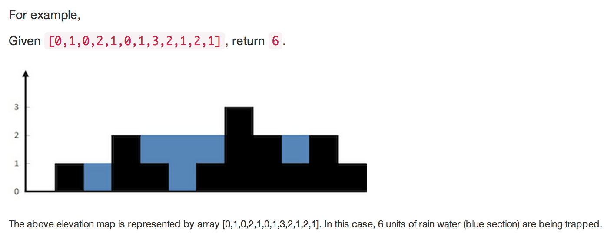

# Array

## Remove Duplicates from Sorted Array (lc)

**Description**

Given a sorted array, remove the duplicates in place such that each element appear only once and return the new length.

Do not allocate extra space for another array, you must do this in place with constant memory.

For example, Given input array A = [1,1,2],
Your function should return length = 2, and A is now [1,2].

**Analysis**

1. Two pointers advance towards the same direction.
2. STL

**Code**

```cpp
class Solution
{
public:

	// O(n), O(1)
    int removeDuplicates(int A[], int n)
    {
        if (n <= 1) // n = 0 or 1
            return n;

        int i = 0, j = 1;
        while (j < n) {
            if (A[j] == A[i])
                j++;
            else {
                A[++i] = A[j++];
            }
        }

        return i + 1;
    }

    // O(n), O(1)
    int removeDuplicates2(int A[], int n)
    {
        if (n <= 1) // n = 0 or 1
            return n;
        return distance(A, unique(A, A + n));
    }
};
```
## Remove Duplicates from Sorted Array || (lc)

**Description**

Follow up for "Remove Duplicates":
What if duplicates are allowed at most twice?

For example,
Given sorted array A = [1,1,1,2,2,3],

Your function should return length = 5, and A is now [1,1,2,2,3].

**Analysis**

Two pointers advance towards the same direction. Be careful about start index at 2.

**Code**

```cpp
// O(n), O(1)
class Solution
{
public:
    int removeDuplicates(int A[], int n)
    {
        if (n <= 2) // n = 0 or 1
            return n;

        int i = 2, j = 2;
        for (; j < n; j++)
            if (A[i - 2] != A[j]) {
                A[i++] = A[j];
            }
        return i;
    }
};
```

## Two Sum (lc)

**Description**

Given an array of integers, find two numbers such that they add up to a specific target number.
The function twoSum should return indices of the two numbers such that they add up to the target,
where index1 must be less than index2. Please note that your returned answers (both index1 and
index2) are not zero-based.

You may assume that each input would have exactly one solution.

Input: numbers={2, 7, 11, 15}, target=9
Output: index1=1, index2=2

**Analysis**

Use hash to avoid OJ TLE error.

**Code**

```cpp
// O(n), O(n)
class Solution
{
public:
    vector<int> twoSum(vector<int> &numbers, int target)
    {
        vector<int> ret;
        unordered_map<int, int> hash;

        for (int i = 0; i < numbers.size(); i++) {
            hash[numbers[i]] = i; // store position
        }

        // traverse the original array, if it has duplicate numbers and those duplicate
        // numbers' sum is target, it must have two duplicates as there exists a solution
        // we keep the latter one's subscript in hash table.
        for (int i = 0; i < numbers.size(); i++) { // original array
            int key = target - numbers[i];
            auto ite = hash.find(key);
            if (ite != hash.end() && ite->second != i) {
                ret.push_back(i + 1);
                ret.push_back(ite->second + 1);
                return ret;
            }
        }
    }
};
```

## 3sum (lc)

**Description**

Given an array S of n integers, are there elements a, b, c in S
such that a + b + c = 0? Find all unique triplets in the array
which gives the sum of zero.

Note:

Elements in a triplet (a,b,c) must be in non-descending order. (ie, a <= b <= c)
The solution set must not contain duplicate triplets.
For example, given array S = {-1 0 1 2 -1 -4},

A solution set is:
(-1, 0, 1)
(-1, -1, 2)

**Analysis**

Sort plus Two pointers.

**Code**

```cpp
// O(n^2), O(n)
// considering: -n, -n+1, -n+2, ..., 0, 1, 2, ..., n, target is 0
// total solutions is n
class Solution
{
public:
    vector<vector<int> > threeSum(vector<int> &num)
    {
        set<vector<int> > ret; //eliminate duplicate solution
        int i = 0, len = num.size();

        sort(num.begin(), num.end());
        for (i = 0; i < len - 2; i++) {
            // without this line, cannot pass new OJ system
            if (i > 0 && num[i] == num[i - 1]) continue;

            int start = i + 1, end = len - 1;
            int sum = 0;
            // two pointers move toward each other. O(n)
            while (start < end) {
                sum = num[i] + num[start] + num[end];
                if (sum == 0) {
                    vector<int> selection = { num[i], num[start], num[end] };
                    ret.insert(selection);
                    // continue find other combinations leading with num[i]
					// such that sum == 0
                    start++;
                    end--;
                } else if (sum < 0) {
                    start++;
                } else {
                    end--;
                }
            }
        }
        return vector<vector<int>>(ret.begin(), ret.end());
    }
};
```

## 3Sum Closest (lc)

**Description**

Given an array S of n integers, find three integers in S such that the sum is
closest to a given number, target. Return the sum of the three integers.
You may assume that each input would have exactly one solution.

For example, given array S = {-1 2 1 -4}, and target = 1.

The sum that is closest to the target is 2. (-1 + 2 + 1 = 2).

**Analysis**

Sort plus Two pointers.

**Code**

```cpp
// O(n2), O(1)
class Solution
{
public:
    int threeSumClosest(vector<int> &num, int target)
    {
        int len = num.size();
        if (len <= 2) //invalid
            return -1;

        sort(num.begin(), num.end());
        // long long, otherwise, closestSum - target might be overflow
        long long closestSum = INT_MAX;
        int sum = 0;
        int diff = 0;
        int start = 0, end = 0;
        for (int i = 0; i < len - 2; i++) {
            start = i + 1, end = len - 1;
            // two pointers move toward each other. O(n)
            while (start < end) {
                sum = num[i] + num[start] + num[end];
                diff = sum - target;
                if (abs(diff) < abs(closestSum - target)) {
                    closestSum = sum;
                }
                if (diff < 0) {
                    start++;
                } else if (diff > 0) {
                    end--;
                } else {
                    return closestSum;
                }
            }
        }

        return closestSum;
    }
};
```


## 4Sum (lc)

**Description**

Given an array S of n integers, are there elements a, b, c, and d in S
such that a + b + c + d = target? Find all unique quadruplets in the array
which gives the sum of target.

Note:

Elements in a quadruplet (a,b,c,d) must be in non-descending order.
(ie, a <= b <= c <= d) The solution set must not contain duplicate
quadruplets.

For example, given array S = {1 0 -1 0 -2 2}, and target = 0.

A solution set is:

> (-1,  0, 0, 1)

> (-2, -1, 1, 2)

> (-2,  0, 0, 2)

**Analysis**

Sort plus Two pointers.

**Code**

```cpp
// O(n^3), O(n)
class Solution
{
public:
    vector<vector<int> > fourSum(vector<int> &num, int target)
    {
        set<vector<int> > ret; //eliminate duplicate cases
        int i, j, len = num.size();

        sort(num.begin(), num.end());
        for (i = 0; i < len - 3; i++) {
            for (j = i + 1; j < len - 2; j++) {
                int start = j + 1, end = len - 1;
                int sum = 0;
                // two pointers move toward each other. O(n)
                while (start < end) {
                    sum = num[i] + num[j] + num[start] + num[end];
                    if (sum == target) {
                        vector<int> selection = { num[i], num[j], num[start],
                                                  num[end]
                                                };
                        ret.insert(selection);
                        // continue find other combinations leading with num[i]
						// such that sum == 0
                        start++;
                        end--;
                    } else if (sum < target) {
                        start++;
                    } else {
                        end--;
                    }
                }
            }
        }

        return vector<vector<int>>(ret.begin(), ret.end());
    }
};
```

## Remove Element (lc)

**Description**

Given an array and a value, remove all instances of that value
in place and return the new length.

The order of elements can be changed.
It doesn't matter what you leave beyond the new length.

**Analysis**

No.

**Code**

```cpp
// O(n), O(1)
class Solution
{
public:
    int removeElement3(int A[], int n, int elem)
    {
        int idx = 0;

        for (int i = 0; i < n; i++) {
            if (A[i] != elem) A[idx++] = A[i];
        }

        return idx;
    }
};
```

## Next Permutation (lc)

**Description**

Implement next permutation, which rearranges numbers into
the lexicographically next greater permutation of numbers.

If such arrangement is not possible, it must rearrange it
as the lowest possible order (ie, sorted in ascending order).

The replacement must be in-place, do not allocate extra memory.

Here are some examples. Inputs are in the left-hand column and
its corresponding outputs are in the right-hand column.

> 1,2,3 → 1,3,2

> 3,2,1 → 1,2,3

> 1,1,5 → 1,5,1

**Analysis**

1. Find the largest index k, such that A[k] < A[k+1]. If not exist, this is the last
   permutation. Just reverse the vector to get the first permutation.
2. Find the largest index l, such that A[l] > A[k].
3. Swap A[k] and A[l].
4. Reverse A[k+1] to the end

**Code**

```cpp
// O(n), O(1)
class Solution
{
public:
    void nextPermutation(vector<int> &num)
    {
        int k = num.size() - 2;
        while (k >= 0) { // step 1
            if (num[k] < num[k + 1])
                break;
            k--;
        }
        if (k < 0) {
            reverse(num.begin(), num.end());
            return;
        }

        int l = num.size() - 1;
        while (l > k) { // step 2
            if (num[l] > num[k])
                break;
            l--;
        }

        swap(num[k], num[l]); // step 3
        reverse(num.begin() + k + 1, num.end()); // step 4
    }
};
```


## Valid Sudoku (lc)

**Description**

Determine if a Sudoku is valid

The Sudoku board could be partially filled, where empty cells are filled with the character '.'.

**Analysis**

Programming details. No algorithm tricks.

**Code**

```cpp
// O(n^2), O(n)
class Solution
{
public:
    bool isValid(char ch, vector<bool> &used)
    {
        if (ch == '.')
            return true;
        if (used[ch - '1'])
            return false;
        used[ch - '1'] = true; // not '.' and non use, use it
        return true;
    }

    bool isValidSudoku(vector<vector<char>> &board)
    {
        const int len = 9; // board size, must be 9

        vector<bool> used(len, false); // record whether a number is used.

        // check each row and column
        for (int i = 0; i < len; i++) {
            fill(used.begin(), used.end(), 0);
            for (int j = 0; j < len; j++) { // check row
                if (!isValid(board[i][j], used))
                    return false;
            }

            fill(used.begin(), used.end(), 0);
            for (int j = 0; j < len; j++) { // check column
                if (!isValid(board[j][i], used))
                    return false;
            }
        }

        // check 3x3 sub boxes of the grid
        // row and col are coefficient
        for (int row = 0; row < 3; row++) {
            for (int col = 0; col < 3; col++) {

                fill(used.begin(), used.end(), 0);
                for (int i = row * 3; i < row * 3 + 3; i++) {
                    for (int j = col * 3; j < col * 3 + 3; j++) {
                        if (!isValid(board[i][j], used))
                            return false;
                    }
                }
            }
        }

        return true; // success
    }
};
```

## Trapping Rain Water (lc)

**Description**

Given n non-negative integers representing an elevation map
where the width of each bar is 1, compute how much water it
is able to trap after raining.



**Analysis**

Find the max in array, and then calculate from left to right and right to left respectively.

**Code**

```cpp
// O(n), O(1)
class Solution
{
public:
    int trap(int A[], int n)
    {
        int *pbegin = A, *pend = A + n;
        int *pmax = max_element(pbegin, pend);
        int h = 0, water = 0;

        // calculate from left to max
        // either update height or accumulate water
        for (; pbegin < pmax; pbegin++) {
            if (*pbegin > h)
                h = *pbegin;
            else {
                water += h - *pbegin;
            }
        }

        // calculate from right to max
        // either update height or accumulate water
        h = 0;
        --pend;
        for (; pend > pmax; pend--) {
            if (*pend > h)
                h = *pend;
            else {
                water += h - *pend;
            }
        }

        return water;
    }
};
```

Above solutioin needs to traverse array twice. We can use stack to traverse the array once.

Using stack to store non-ascending order of elements, if encounter element which is greater than stack top, pop stack and calculate water.

```cpp
// O(n), O(n)
class Solution
{
public:
    int trap(int A[], int n)
    {
        stack<pair<int, int>> stk;
        int water = 0;
        int i = 0;

        while (i < n) {
            // push stack
            if (stk.empty() || stk.top().second >= A[i]) {
                stk.push(make_pair(i, A[i]));
                i++;
            } else { // greater than stack top
                pair<int, int> p = stk.top();
                stk.pop();

                // cannot form water
                if (stk.empty()) {
                    stk.push(make_pair(i, A[i]));
                    i++;
                    continue;
                }

                // calculate water
                water += (min(A[i], stk.top().second) - p.second) *
                         (i - stk.top().first - 1);
            }
        }
        return water;
    }
};
```

## Rotate Image (lc)

**Description**

You are given an n x n 2D matrix representing an image.

Rotate the image by 90 degrees (clockwise).

Follow up: could you do this in-place?

**Analysis**

* swap elements around counter-diagonal

* swap element around horizontal middle line

**Code**

```cpp
// O(n^2), O(1)
class Solution
{
public:
    void rotate(vector<vector<int>> &matrix)
    {
        int len = matrix.size();
        if (len <= 1) return;

        // swap counter-diagonal
        for (int i = 0; i < len; i++) {
            for (int j = 0; j < len - i; j++) {
                swap(matrix[i][j], matrix[len - 1 - j][len - 1 - i]);
            }
        }

        // swap horizontal middle line
        for (int i = 0; i < len / 2; i++) {
            for (int j = 0; j < len; j++) {
                swap(matrix[i][j], matrix[len - 1 - i][j]);
            }
        }
    }
};
```

## Plus One (lc)

**Description**

Given a non-negative number represented as an array of digits, plus one to the number.

The digits are stored such that the most significant digit is at the head of the list.

**Analysis**

Be careful about the last `1`.

**Code**

```cpp
// O(n), O(1)
class Solution
{
public:
    vector<int> plusOne(vector<int> &digits)
    {
        int n = digits.size() - 1;
        int carry = 1;
        int sum = 0;

        while (n >= 0 && carry) {
            sum = digits[n] + carry;
            digits[n] = sum % 10;
            carry = sum / 10;
            n--;
        }

        if (carry)
            digits.insert(digits.begin(), 1);

        return digits;
    }
};
```