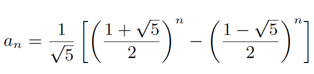

# Math

## Cantor Formula

`X = a[n]*(n-1)!+a[n-1]*(n-2)!+ ... +a[i]*(i-1)!+ ... +a[2]*1!+a[1]*0!,` a[i] is integer, and 0 <= a[i] < i (1 <= i <= n), this equation maps a natural number.

For example, 3 5 7 4 1 2 9 6 8 maps 98884. Because:

`X = 2*8!+3*7!+4*6!+2*5!+0*4!+0*3!+2*2!+0*1!+0*0! = 98884`

* Considering first number 3, so there are two numbers(1, 2) less than 3,
    and permutation leading with them is 8!, so it is 2 * 8!

* Considering the second number 5, there are four numbers(1, 2 ,3 , 4) less than it, and 3 was used in the first item, so there remains 3 numbers (1, 2, 4) usable. That is 3 * 7!

* ...

**Application**

1. Find sequence's rank in set [1 ... n]

2. Find the Kth permutation sequence from set [1,2,3 ... n]

### Permutation Sequence (lc)

**Description**

The set [1,2,3 … n] contains a total of n! unique permutations.

By listing and labeling all of the permutations in order,
We get the following sequence (ie, for n = 3):

> "123"

> "132"

> "213"

> "231"

> "312"

> "321"

Given n and k, return the kth permutation sequence.
Note: Given n will be between 1 and 9 inclusive.

**Analysis**

Cantor formula.

**Code**

```cpp
// O(n), O(n)
class Solution
{
public:
    long long factorial(int n)
    {
        long long product = 1;
        for (int i = 2; i <= n; i++) {
            product *= i;
        }
        return product;
    }

    string getPermutation(int n, int k)
    {
        if (n < 1 || k < 1)
            return "";

        string orig(n, '0'), ret;
        for (int i = 1; i <= n; i++) {
            orig[i - 1] += i;
        }

        // Cantor encode, minus one to start from 0
        // because we will use %
        --k;
        int base = factorial(n - 1); // (n-1)!

        for (int i = n - 1; i > 0; k %= base, base /= i, --i) {
            // judge it belongs to which permutation
            // the sub permu, leading with orig[sub]
            int sub = k / base;
            ret += orig[sub];
            orig.erase(sub, 1);
        }
        ret += orig[0]; // i == 0, the last one

        return ret;
    }
};
```


### Find sequence's rank in permutation [1 ... n]

**Code**

```cpp
// O(n^2), O(1)
class Solution
{
public:
    long long factorial(int n)
    {
        long long product = 1;
        for (int i = 2; i <= n; i++) {
            product *= i;
        }
        return product;
    }

    int rank(vector<int> &v)
    {
        int rank = 0;
        int n = v.size();

        for (int i = 0; i < n; i++) {
            int little = 0;
            for (int j = i + 1; j < n; j++)
                if (v[j] < v[i])
                    little++;

            rank += little * factorial(n - i - 1);
        }

        return rank + 1; // cantor starts counting from 0
    }
};
```

## Fibonacci

`F(n) = F(n-1) + F(n-2)`



**Solutions**

1. iteration (O(n))

2. general term formula, may not be accurate as double decision (O(1))

3. matrix (divide and conquer, O(logn))

4. induction of definition (O(longn))


### Climbing Stairs (lc)

**Description**

You are climbing a staircase. It takes n steps to reach to the top.
Each time you can either climb 1 or 2 steps. In how many distinct ways
can you climb to the top?


**Code**

```cpp
class Solution
{
public:
    // O(n), O(1)
    int climbStairs(int n)
    {
        if (n == 1)
            return 1; // bug
        int s1 = 1, s2 = 2;
        for (int i = 3; i <= n; i++) {
            int t = s1 + s2;
            s1 = s2;
            s2 = t;
        }

        return s2;
    }

    // O(1), O(1)
    int climbStairs2(int n)
    {
        if (n == 1)
            return 1;

        double root5 = sqrt(5);
        return (1 / root5) * (pow((1 + root5) / 2, n + 1) -
                    pow((1 - root5) / 2, n + 1)); // n + 1
    }
};
```

## Euclidean

### Basic Euclidean Algorithm

**Formula**

> gcd(a, b) = gcd(b, a mod b)

**Proof**

Let a = kb + r, so r = a mod b

1. let d = gcd(a, b)

>	r = a - kb             (1)

>	d is gcd(a, b) -> d|a, d|b   (2)

>	(1), (2) -> d|r -> d is a common divisor of b and r.

2. let d = gcd(b, r)

>	d|b, d|r

>	a = kb + r -> d|a, d is a common divisor of a and b.

According to above inference, gcd(a, b) and gcd(b, a mod b) have the same common divisor, so they have the same greatest common divisor.

Note: least common multiple

> lcm(a, b) = a * b / gcd(a, b)

```cpp
// greatest common divisor
class Solution
{
public:
    int gcd_rec(int a, int b)
    {
        if (b == 0) return a;
        return gcd_rec(b, a % b);
    }

    int gcd_ite(int a, int b)
    {
        int mod = 0;
        while (b) {
            mod = a % b;
            a = b;
            b = mod;
        }

        return a;
    }

    int gcd_ite2(int a, int b)
    {
        while (a != b) {
            if (a > b) a -= b;
            else b -= a;
        }
        return a;
    }
};
```

### Extension Euclidean algorithm

> gcd(a, b) = ax + by

We can get a pair coefficient (x, y) such that ax + by = gcd(a, b).

**Proof**

let gcd(a, b) = ax1 + by1

gcd(b, a % b) = bx2 + (a % b)y2 = bx2 + (a - (a/b)*b)y2

gcd(a, b) = gcd(b, a % b) -> ax1 + by1 = ay2 + b(x2 - a/b * y2)

So the iteration equation is:

> x1 = y2

> y1 = x2 - a / b * y2

```cpp
class Solution
{
public:

    int egcd(int a, int b, int &x, int &y)
    {
        if (b == 0) {
            x = 1;
            y = 0;
            return a;
        } else {
            int gcd = egcd(b, a % b, x, y);
            int x2 = x, y2 = y;
            x = y2;
            y = x2 - (a / b) * y2;
            return gcd;
        }
    }

    int egcd_ite(int a, int b, int &x, int &y)
    {
        int x0, y0, x1, y1;

        x0 = 1;
        y0 = 0;
        x1 = 0;
        y1 = 1;
        x = 0;
        y = 1;

        int r = a % b; // remainder
        int q = a / b; // quotient

        while (r) {
            x = x0 - q * x1;
            y = y0 - q * y1;

            x0 = x1;
            y0 = y1;
            x1 = x;
            y1 = y;

            a = b;
            b = r;
            r = a % b;
            q = a / b;
        }

        return b; // b
    }
};
```