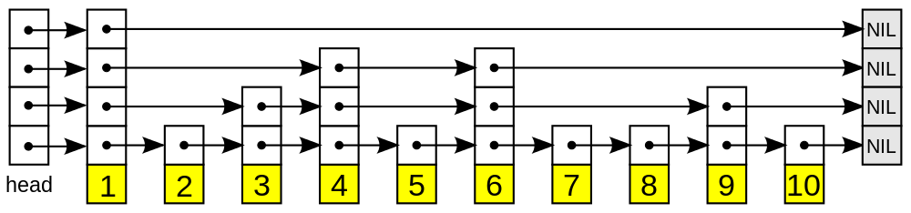

# Advanced Data Structure

## Heap

Heap is similar to priority_queue in C++ STL.

### Implementation

```cpp
// max heap
class Heap
{
private:
    vector<int> m_data; // heap data
    size_t m_size; // heap size

    void sift_up(int i)
    {
        while (i > 1 && m_data[i] > m_data[i / 2]) {
            swap(m_data[i], m_data[i / 2]);
            i /= 2;
        }
    }

    void sift_down(int i)
    {
        int j = 2 * i; // j is the left child

        while (j <= m_size) { // loop until leaf
            // find max child
            if (j + 1 <= m_size && m_data[j + 1] > m_data[j])
                j += 1;

            // swap if possible
            if (m_data[i] < m_data[j]) {
                swap(m_data[i], m_data[j]);
                i = j;
                j *= 2;
            } else {
                break;
            }
        }
    }

    void make_heap()
    {
        for (int i = m_size / 2; i > 0; i--) {
            sift_down(i);
        }
    }

public:
    Heap(vector<int> &v)
    {
        m_size = v.size();

        // do not use m_data[0] to simplify sift_down operation
        // as when parameter i is 0, cannot find left child using 2*i
        m_data.resize(m_size + 1);
        m_data[0] = -1;

        copy(v.begin(), v.end(), m_data.begin() + 1);
        make_heap();
    }

    void push_heap(int val)
    {
        m_data.push_back(val);
        m_size++;
        sift_up (m_size);
    }

    int pop_heap()
    {
        int val = get_top();
        swap(m_data[1], m_data[m_size]);
        m_data.pop_back();
        m_size--;
        sift_down(1);
        return val;
    }

    int get_top()
    {
        return m_data[1];
    }

    int get_size()
    {
        return m_size;
    }
};
```

### Application

#### Heap Sort

```cpp
class HeapSort
{
private:
    Heap hp;

public:
    HeapSort(vector<int> &v) : hp(v)
    {
    }

    vector<int> sort()
    {
        vector<int> ret;
        while (hp.get_size()) {
            ret.push_back(hp.pop_heap());
        }
        return ret;
    }
};
```

Or we can just sort it in place:

```cpp
class HeapSort
{
private:
    void sift_down(vector<int> &v, int vs, int i)
    {
        int j = 2 * i; // j is the left child

        while (j <= vs) { // loop until leaf
            // find max child
            if (j + 1 <= vs && v[j + 1] > v[j])
                j += 1;

            // swap if possible
            if (v[i] < v[j]) {
                swap(v[i], v[j]);
                i = j;
                j *= 2;
            } else {
                break;
            }
        }
    }

    void make_heap(vector<int> &v, int vs)
    {
        for (int i = vs / 2; i > 0; i--) {
            sift_down(v, vs, i);
        }
    }

public:
    void Sort(vector<int> &v)
    {
        int vs = v.size();

        // do not use v[0] to simplify sift_down operation
        // as when parameter i is 0, cannot find left child using 2*i
        v.insert(v.begin(), -1);

        make_heap(v, vs);

        while (vs > 1) {
            swap(v[1], v[vs]);
            vs--;
            sift_down(v, vs, 1);
        }

        v.erase(v.begin());
    }
};
```

Core functions here are *sift_down* and *sift_up* operations.

#### Find the median of a data flow at anytime （cc）

Maintain two heaps: *small* heap and *big* heap respectively. All elements from small heap are smaller than those in big heap.

And we use **max heap** to construct small heap(top is the max element) and **min heap** to construct big heap(top is the minimum element).

When a new **element** comes, compare it with the top of two heaps(smallTop, bigTop).

   * insert **element** to small heap if element < smallTop

   * insert **element** to big heap if element > bigTop

   * always make sure abs(smallSize - bigSize) <= 1.

For simplicity, let smallSize >= bigSize, so at anytime, the median is either

>   smallTop,  (smallSize > bigSize)

or

>   (smallTop + bigTop) / 2, (smallSize == bigSize)

Note: there is a O(n) algorithm to find a median of a **given array**.

## Union Find Set

### People Infected Virus

**Description**

There are n (0...n-1) students, m student unions, each union has k students.
Calculate how many people are infected of virus if people zero is infected?


Input:

First line has two numbers n and m. Following m lines are each union's students.
The first number is students number k, and then following k numbers standing for students ID.

Last line 0 0 means ending input.

100 4

2 1 2

5 10 13 11 12 14

2 0 1

2 99 2

200 2

1 5

5 1 2 3 4 5

1 0

0 0

**Analysis**

We can merge those students who are in the same student union to one set when reading input data. 
And meanwhile calculate how many students in this set. The count of set with student ID 0 is the result.

This is a typical use of UFS and it just records student's number.
In other cases, we can record any info in the node specific to that question.

**Code**

```cpp
class UnionFindSet
{
private:
    struct Node {
        int parent; // parent of this node
        int rank; // rank value for merge

        // can record any data here
        int cnt; // number of people infected in this set

        Node(): parent(-1), rank(0), cnt(1) {}
    };

    vector<Node> node;

public:
    UnionFindSet(int n) : node(n + 1) {}

    int Find(int x)
    {
        if (node[x].parent == -1) return x;
        return node[x].parent = Find(node[x].parent); // compress path
    }

    void Union(int x, int y)
    {
        int u1 = Find(x);
        int u2 = Find(y);

        if (u1 == u2) return; // same set

        if (node[u1].rank < node[u2].rank) {
            node[u1].parent = u2;
            node[u2].cnt += node[u1].cnt;
        } else { // >=
            node[u2].parent = u1;
            node[u1].rank = max(node[u1].rank, node[u2].rank + 1);
            node[u1].cnt += node[u2].cnt;
        }
    }

    int GetNum(int x)
    {
        return node[Find(x)].cnt;
    }
};

int main(int argc, char *argv[])
{
#ifndef ONLINE_JUDGE
    freopen("input", "r", stdin);
    // freopen("output","w",stdout);
#endif

    int n, m, k;

    while (cin >> n >> m && n > 0) {
        UnionFindSet ufs(n);

        while (m--) {
            int x, y; // two students

            cin >> k;
            k--;
            cin >> x;

            while (k--) {
                cin >> y;
                ufs.Union(x, y);
            }
        }
        cout << ufs.GetNum(0) << endl;
    }

    return 0;
}
```

## SkipList

**Introduction**



Skip List is a data structure that allows **fast** search within an **ordered** sequence of elements.

Fast search is made possible by maintaining a **linked hierarchy** of subsequences, each skipping over fewer elements. The elements that are skipped over may be chosen **probabilistically**.

**Complexity**

You may have known about AVL tree and Red-Black tree, both get O(log n) in worst case. However, it may be hard to implement them in a short time, especially for AVL tree.

Now, you have an another choice, that is Skip List, it works well in practice. And the most important is that it is easy to implement.


Name    | Average   |  Worst case
------- | --------- | -----------:
Space   | O(n)      | O(n)
Insert  | O(log n)  | O(n)
Delete  | O(log n)  | O(n)
Find    | O(log n)  | O(n)

**Code**

```cpp
// simple skiplist implementation
// 1) do not consider duplicate data
// 2) no backward pointer in the node

class SkipList
{
private:
    struct skiplistNode {
        int data; // node's data
        vector<skiplistNode*> level; // level array

        skiplistNode(int d, int l) : data(d), level(l)
        {
        }
    };

    int m_maxlevel; // max level of skip list
    int m_curlevel; // current level of skip list
    int m_len; // number of nodes
    const double m_prob; // probability

    skiplistNode head; // dumb head

    // get random level for a node
    int RandomLevel()
    {
        int level = 1;
        // m_prob probability to reach to upper level
        while ((random() & 0xFFFF) < (m_prob * 0xFFFF))
            level += 1;

        return (level < m_maxlevel) ? level : m_maxlevel;
    }

public:

    SkipList(const int ml = 32, const double p = 0.25) :
        m_maxlevel(ml), m_prob(p), head(INT_MIN, m_maxlevel)
    {
        m_curlevel = 1; // only one level when initialization
        m_len = 0;
    }

    bool Insert(int data)
    {
        // Considering a single linked list, when inserting
        // an element, we need to get the previous pointer

        // As for skiplist, each level is a list, so we need
        // to keep a previous pointer for each level

        vector<skiplistNode*> prev(m_maxlevel);

        // traverse each level to get prev array
        skiplistNode *x = &head;
        for (int i = m_curlevel - 1; i >= 0; i--) {
            // minus i : move towards bottom
            // forward x : move towards right
            while (x->level[i] && x->level[i]->data < data) {
                x = x->level[i];
            }
            prev[i] = x; // update current level's previous pointer
        }

        // duplicate data
        if (x->level[0] && x->level[0]->data == data) return false;

        int level = RandomLevel();
        // increase skiplist's level
        if (level > m_curlevel) {
            for (int i = m_curlevel; i < level; i++) {
                prev[i] = &head; // update prev array
            }
            m_curlevel = level; // update level
        }

        // insert new node
        x = new skiplistNode(data, level);
        if (x == nullptr) return false; // no memory
        for (int i = 0; i < level; i++) {
            // insert x after pointer prev[i]
            x->level[i] = prev[i]->level[i];
            prev[i]->level[i] = x;
        }

        m_len++;
        return true;
    }

    bool Delete(int data)
    {
        // again, we need to keep previous pointer as
        // single linked list delete operation
        vector<skiplistNode*> prev(m_maxlevel);

        // traverse each level to get prev array
        skiplistNode *x = &head;
        for (int i = m_curlevel - 1; i >= 0; i--) {
            while (x->level[i] && x->level[i]->data < data) {
                x = x->level[i];
            }

            prev[i] = x; // update current level's previous pointer
        }

        x = x->level[0];
        if (x == nullptr || x->data != data) return false; // not exist

        // delete
        for (int i = 0; i < m_curlevel; i++) {
            if (prev[i]->level[i] == x) {
                prev[i]->level[i] = x->level[i]; // delete node
            }
        }
        delete x;
        x = nullptr;

        while(m_curlevel > 1 && head.level[m_curlevel - 1] == NULL)
            m_curlevel--; // delete null list on the top

        m_len--; // update length
        return true;
    }

    bool Find(int data)
    {
        skiplistNode *x = &head;
        for (int i = m_curlevel - 1; i >= 0; i--) {
            while (x->level[i] && x->level[i]->data < data) {
                x = x->level[i];
            }

            if (x->level[i] && x->level[i]->data == data) return true;
        }
        return false;
    }
};
```

**Reference**

* [http://epaperpress.com/sortsearch/download/skiplist.pdf](http://epaperpress.com/sortsearch/download/skiplist.pdf)
* [http://en.wikipedia.org/wiki/Skip_list](http://en.wikipedia.org/wiki/Skip_list)


## Segment Tree

Segment tree is a tree data structure for storing intervals, or segments. It allows querying which of the stored segments contain a given point. It is, in principle, a static structure; that is, its content cannot be modified once the structure is built. A similar data structure is the interval tree.

A segment tree for a set I of n intervals uses O(n log n) storage and can be built in O(n log n) time. Segment trees support searching for all the intervals that contain a query point in O(log n + k), k being the number of retrieved intervals or segments.

**Reference**

* [http://en.wikipedia.org/wiki/Segment_tree](http://en.wikipedia.org/wiki/Segment_tree)

### [Balanced Lineup](http://poj.org/problem?id=3264)

**Description**

For the daily milking, Farmer John's N cows (1 <= N <= 50,000) always line up in the same order. One day Farmer John decides to organize a game of Ultimate Frisbee with some of the cows. To keep things simple, he will take a contiguous range of cows from the milking lineup to play the game. However, for all the cows to have fun they should not differ too much in height.

Farmer John has made a list of Q (1 <= Q <= 200,000) potential groups of cows and their heights (1 <= height <= 1,000,000). For each group, he wants your help to determine the difference in height between the shortest and the tallest cow in the group.

**Input**

Line 1: Two space-separated integers, N and Q.

Lines 2..N+1: Line i+1 contains a single integer that is the height of cow i

Lines N+2..N+Q+1: Two integers A and B (1 <= A <= B <= N), representing the range of cows from A to B inclusive.

**Output**

Lines 1..Q: Each line contains a single integer that is a response to a reply and indicates the difference in height between the tallest and shortest cow in the range.

**Sample Input**

6 3

1

7

3

4

2

5

1 5

4 6

2 2

**Sample Output**

6

3

0

**Code**

Using array to implement segment tree.

```cpp
class SegmentTree
{
private:
    // tree node
    struct TreeNode {
        int left; // segment's left point
        int right; // segment's right point

        // here we can record anything specific to a problem
        // i.e.: sum, max or min element, and so on
        int minEle; // min element in the scope[left...right]
        int maxEle; // max element in the scope[left...right]

        TreeNode(): left(0), right(0), minEle(0), maxEle(0) {}
    };

    vector<TreeNode> treeNode; // tree node set, treeNode[1] is root

    // build perfect binary tree
    // using array(treeNode) to store it
    void build(vector<int> &data, int t, int left, int right)
    {
        // set segment's start and end point
        treeNode[t].left = left;
        treeNode[t].right = right;

        if (left == right) {
            treeNode[t].minEle = treeNode[t].maxEle = data[left];
            return;
        }

        // build left and right tree recursively
        int mid = left + ((right - left) >> 1);
        int leftRoot = t * 2;
        int rightRoot = leftRoot + 1;
        build(data, leftRoot, left, mid);
        build(data, rightRoot, mid + 1, right);

        // update info
        treeNode[t].minEle = min(treeNode[leftRoot].minEle, treeNode[rightRoot].minEle);
        treeNode[t].maxEle = max(treeNode[leftRoot].maxEle, treeNode[rightRoot].maxEle);
    }

    void query(int t, int left, int right, int &lower, int &upper)
    {
        if (treeNode[t].left == left && treeNode[t].right == right) {
            lower = min(lower, treeNode[t].minEle);
            upper = max(upper, treeNode[t].maxEle);
            return;
        }

        int mid = treeNode[t].left + ((treeNode[t].right - treeNode[t].left) >> 1);
        if (left > mid) { // search right child
            query(2 * t + 1, left, right, lower, upper);
        } else if (right <= mid) { // search left child
            query(2 * t, left, right, lower, upper);
        } else { // search both
            query(2 * t, left, mid, lower, upper);
            query(2 * t + 1, mid + 1, right, lower, upper);
        }
    }

public:
    // 2 * n is enough to store the tree with n leaves
    SegmentTree(vector<int> &v) : treeNode(v.size() * 2)
    {
        build(v, 1, 1, v.size() - 1);
    }

    int maxDiff(int left, int right)
    {
        int maxData = INT_MIN, minData = INT_MAX;
        query(1, left, right, minData, maxData);
        return maxData - minData;
    }
};

int main(int argc, char *argv[])
{
#ifndef ONLINE_JUDGE
    freopen("input", "r", stdin);
    // freopen("output","w",stdout);
#endif

    int n, q;
    int a, b;
    cin >> n >> q;
    vector<int> v(n+1);

    for (int i = 1; i <= n; i++) cin >> v[i];
    SegmentTree sol(v);

    while (cin >> a >> b) {
        cout << sol.maxDiff(a, b) << endl;
    }

    return 0;
}
```

Using chain list to store segment tree.

```cpp
class SegmentTree
{
private:
    // tree node
    struct TreeNode {
        TreeNode *lChild, *rChild;

        int left; // segment's left point
        int right; // segment's right point

        // here we can recode anything specific to a problem
        // i.e.: sum, max or min element, and so on
        int minEle; // min element in the scope[left...right]
        int maxEle; // max element in the scope[left...right]
        TreeNode(const int l = 0, const int r = 0):
            lChild(nullptr), rChild(nullptr), left(l), right(r), minEle(0), maxEle(0) {}
    };

    TreeNode *root;

    // build binary tree
    TreeNode* build(vector<int> &data, int left, int right)
    {
        // set segment's start and end point
        TreeNode *root = new TreeNode(left, right);
        if (root == nullptr) throw runtime_error("no memory");

        if (left == right) {
            root->minEle = root->maxEle = data[left];
            return root;
        }

        // build left and right tree recursively
        int mid = left + ((right - left) >> 1);
        root->lChild = build(data, left, mid);
        root->rChild = build(data, mid + 1, right);

        // update info
        root->minEle = min(root->lChild->minEle, root->rChild->minEle);
        root->maxEle = max(root->lChild->maxEle, root->rChild->maxEle);

        return root;
    }

    void query(TreeNode *t, int left, int right, int &lower, int &upper)
    {
        if (t == nullptr) return; // not happen
        if (t->left == left && t->right == right) {
            lower = min(lower, t->minEle);
            upper = max(upper, t->maxEle);
            return;
        }

        int mid = t->left + ((t->right - t->left) >> 1);
        if (left > mid) { // search right child
            query(t->rChild, left, right, lower, upper);
        } else if (right <= mid) { // search left child
            query(t->lChild, left, right, lower, upper);
        } else { // search both
            query(t->lChild, left, mid, lower, upper);
            query(t->rChild, mid + 1, right, lower, upper);
        }
    }

public:
    SegmentTree(vector<int> &v)
    {
        root = build(v, 1, v.size() - 1);
    }

    int maxDiff(int left, int right)
    {
        int maxData = INT_MIN, minData = INT_MAX;
        query(root, left, right, minData, maxData);
        return maxData - minData;
    }
};
```

## Trie

## Suffix Array


